<h2>MultipleMyeloma-ImageMask-Dataset (2024/03/09)</h2>
This is a MultipleMyeloma ImageMask dataset for Image Segmentation.   
<li>2024/03/09 Generated Augmented-ImageMask-Dataset_V5 of 640x640 pixel-size.</li> 

<h3>1. Dataset Citation</h3>

The original dataset used here has been take from the following  web site:  
<b>SegPC-2021-dataset</b> 
SegPC-2021: Segmentation of Multiple Myeloma Plasma Cells in Microscopic Images 
<pre>
https://www.kaggle.com/datasets/sbilab/segpc2021dataset
</pre>

<b>Citation:</b> 

<pre>
Anubha Gupta, Ritu Gupta, Shiv Gehlot, Shubham Goswami, April 29, 2021, "SegPC-2021: Segmentation of Multiple Myeloma Plasma Cells 
in Microscopic Images", IEEE Dataport, doi: https://dx.doi.org/10.21227/7np1-2q42.

BibTex
@data{segpc2021,
doi = {10.21227/7np1-2q42},
url = {https://dx.doi.org/10.21227/7np1-2q42},
author = {Anubha Gupta; Ritu Gupta; Shiv Gehlot; Shubham Goswami },
publisher = {IEEE Dataport},
title = {SegPC-2021: Segmentation of Multiple Myeloma Plasma Cells in Microscopic Images},
year = {2021} }

IMPORTANT:
If you use this dataset, please cite below publications-
1. Anubha Gupta, Rahul Duggal, Shiv Gehlot, Ritu Gupta, Anvit Mangal, Lalit Kumar, Nisarg Thakkar, and Devprakash Satpathy, 
 "GCTI-SN: Geometry-Inspired Chemical and Tissue Invariant Stain Normalization of Microscopic Medical Images," 
 Medical Image Analysis, vol. 65, Oct 2020. DOI: 
 (2020 IF: 11.148)
2. Shiv Gehlot, Anubha Gupta and Ritu Gupta, 
 "EDNFC-Net: Convolutional Neural Network with Nested Feature Concatenation for Nuclei-Instance Segmentation,"
 ICASSP 2020 - 2020 IEEE International Conference on Acoustics, Speech and Signal Processing (ICASSP), 
 Barcelona, Spain, 2020, pp. 1389-1393.
3. Anubha Gupta, Pramit Mallick, Ojaswa Sharma, Ritu Gupta, and Rahul Duggal, 
 "PCSeg: Color model driven probabilistic multiphase level set based tool for plasma cell segmentation in multiple myeloma," 
 PLoS ONE 13(12): e0207908, Dec 2018. DOI: 10.1371/journal.pone.0207908

License
CC BY-NC-SA 4.0
</pre>

 

<h3>
2. Download master dataset
</h3>
  Please download the original <b>MultipleMyeloma-CT</b> dataset from the following <b>kaggle.com</b> website. 

<a href="https://www.kaggle.com/datasets/salihayesilyurt/pancreas-ct">MultipleMyeloma-CT</a>
Created by Sean Berryman, last modified by Tracy Nolan on Sep 16, 2020 
 

The dataset <b>MultipleMyeloma-CT</b> and has the following folder structure. 

<pre>
./TCIA_SegPC_dataset
├─test
│  └─x
├─train
│  ├─x
│  └─y
└─valid
    ├─x
    └─y
</pre>
Each x sub-folder of test, train, and valid contains bmp image files, and y contains bmp mask files.
 
<b>
Please note that test dataset has no y folder, which means that it has no mask (ground_truth) corresponding to test/x folder.
</b>
 
 
<h3>
3. Create ImageMask Dataset
</h3>
<h3>
3.1 Create ImageMask Dataset
</h3>
Please run the following command. 
<pre>
>python ./MultipleMyelomaImageDatasetGenerator.py
</pre>

By using this Python script <a href="./MultipleMyelomaImageDatasetGenerator.py">MultipleMyelomaImageDatasetGenerator.py</a>,
 we have created  <b>MultipleMyeloma-ImageMask-Dataset_V2</b> jpg image dataset of image-size 512x512 from the 
original <b>./TCIA_SegPC_dataset/</b>. 

<pre>
./MultipleMyeloma-ImageMask-Dataset_V2
├─test
│  ├─images
│  └─masks
├─train
│  ├─images
│  └─masks
└─valid
    ├─images
    └─masks
</pre>

Please note that test/mask folder above becomes empty, because the original test dataset in ./TCIA_SegPC_dataset has no ground_truth. 

<b>train/images samples:</b> 
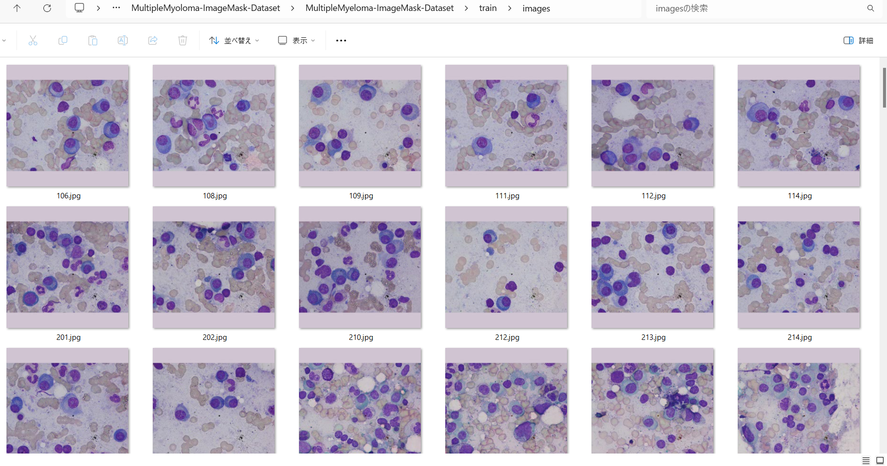
 
<b>train/masks samples:</b> 
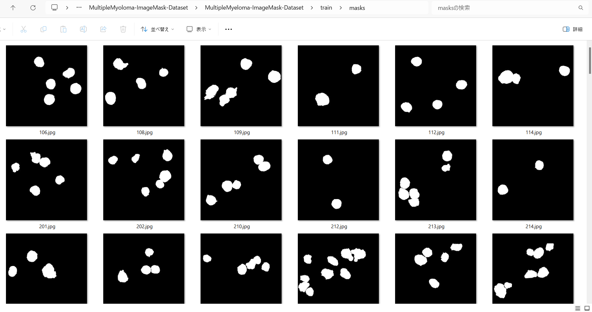
 
MultipleMyeloma-ImageMask-Dataset Statistics: 
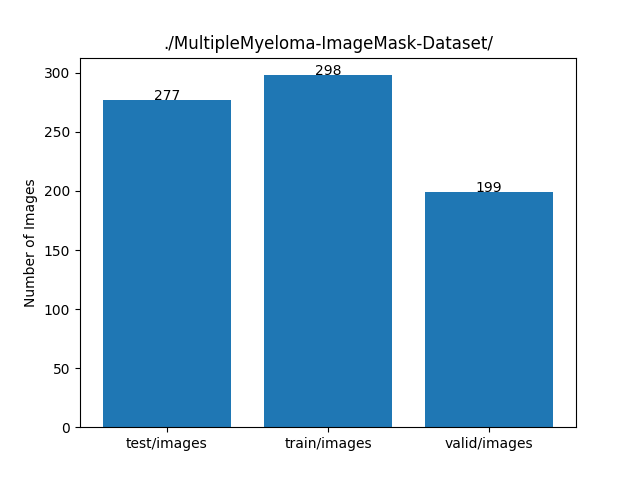 

<h3>3.2 Validate mask regions </h3>
Please run the following command to validate mask regions corresponding to images
in <b>./MultipleMyeloma-ImageMask-Dataset/train</b> folder. 
<pre>
python ImageMaskBlender.py
</pre> 
, by which <b>Blended_train_dataset</b> can be created, 
Blended_train_dataset samples: 
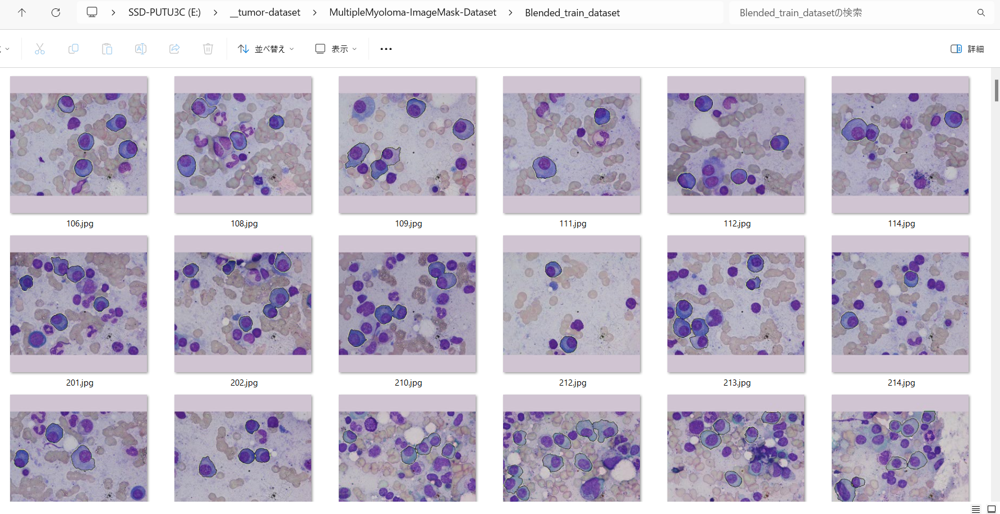 
 
Enlarged images: 
<table>
<tr>
<td></td>
<td>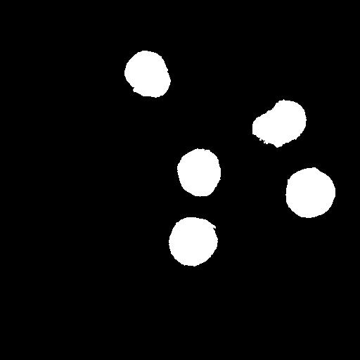</td>
<td>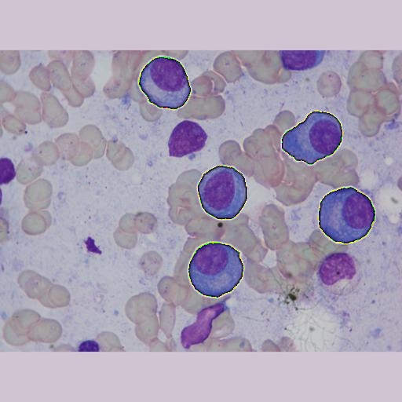</td>
</tr>

<tr>
<td>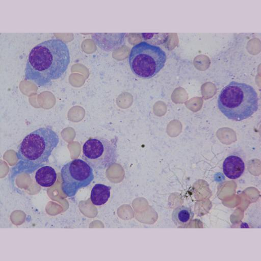</td>
<td>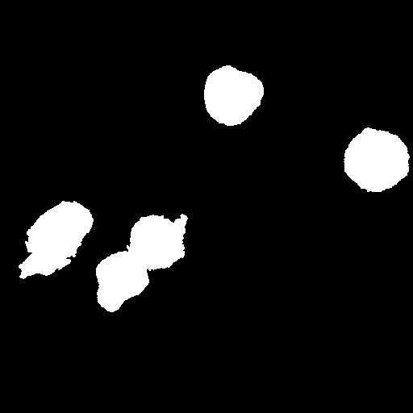</td>
<td>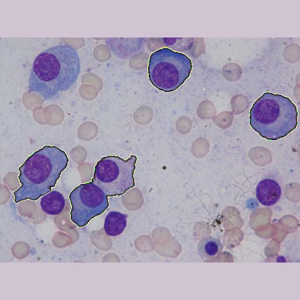</td>
</tr>

<tr>
<td>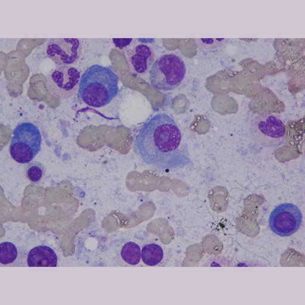</td>
<td>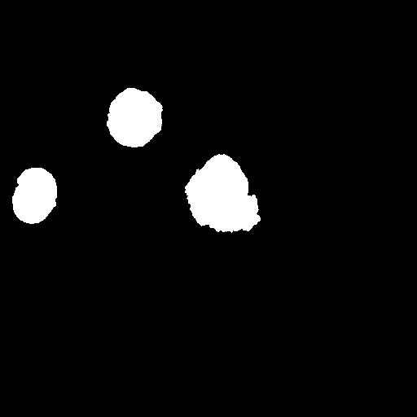</td>
<td>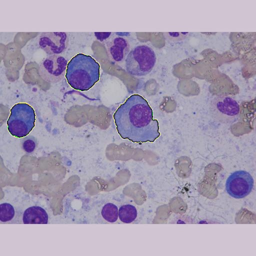</td>
</tr>

<tr>
<td>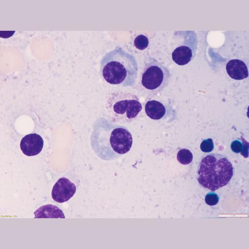</td>
<td>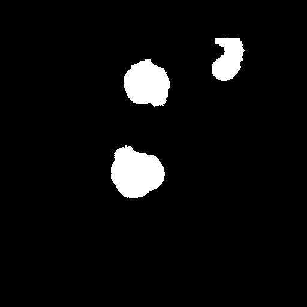</td>
<td>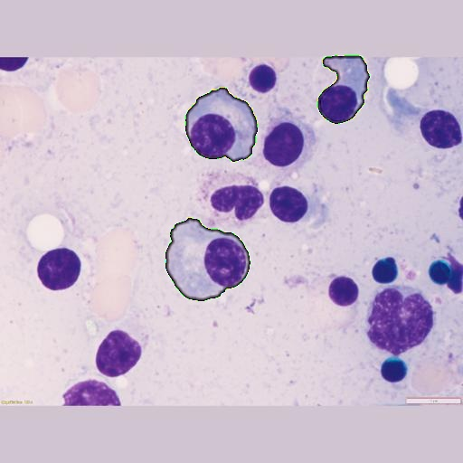</td>
</tr>

<tr>
<td>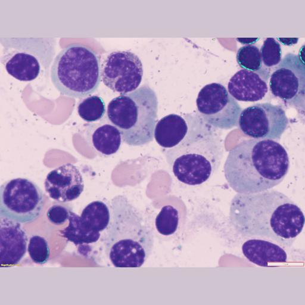</td>
<td>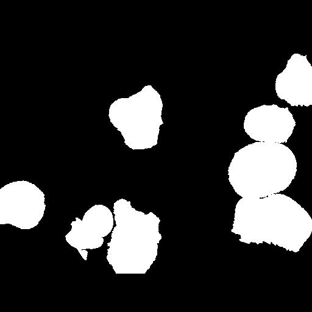</td>
<td>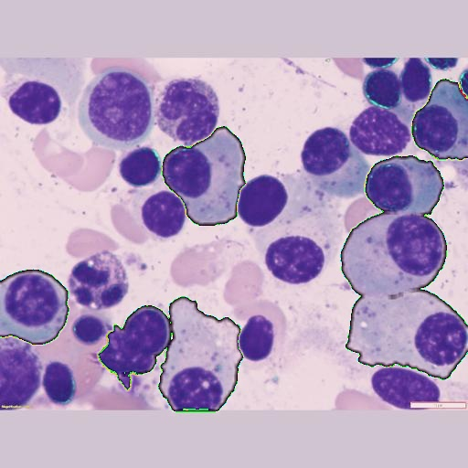</td>
</tr>
</table>
<h3>
3. Download MultipleMyeloma-ImageMask-Dataset_V2.zip
</h3>

You can download this dataset from the following google drive 
<a href="https://drive.google.com/file/d/1mECqWe1TmDaGqg6yMuKCLXNZpmPaw9Ok/view?usp=sharing">MultipleMyeloma-ImageMask-Dataset_V2.zip</a>
 

<h3>
4. Download MultipleMyeloma-ImageMask-Dataset_V2_X.zip
</h3>
Please run the Python script <a href="./split_master.py">split_master.py</a> to create a dataset having ground_truth in all sub-dataset including test. 
<pre>
>python split_master.py
</pre>
<pre>
./MultipleMyeloma-ImageMask-Dataset_V2_X
├─test
│  ├─images
│  └─masks
├─train
│  ├─images
│  └─masks
└─valid
    ├─images
    └─masks
</pre>
 
MultipleMyeloma-ImageMask-Dataset Statistics_V2_X: 
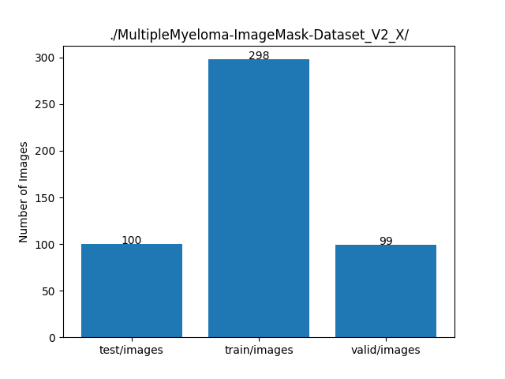 

You can download this dataset from the following google drive 
<a href="https://drive.google.com/file/d/1QiGah4_0yY-5B7s2kIZ2AjbEVu2ejB3G/view?usp=sharing">MultipleMyeloma-ImageMask-Dataset_V2_X.zip</a>
 

<h3>
5. Generate Augmented-MultipleMyeloma-ImageMask-Dataset_V5.zip
</h3>

To generate ImageMaskDataset of images and masks of 640x640 pixel size, and augment those images and masks, 
we have modified generator.config file as shown below. 

<pre>
; generator,config
; 2024/03/09 (C) antillia.com

[generator]
input_dir   = "./TCIA_SegPC_dataset"
;dataset = ["test", "train", "valid"]
datasets = ["train", "valid"]
width      = 640
height     = 640
output_dir = "./Augmented-MultipleMyeloma-ImageMask-Dataset_V5"
mask_merge = True
crop    = False
augment = True

[augmentor]
flip   = True
mirror = True
angles = [90, 180, 270]
</pre>

<pre>
./Augmented-MultipleMyeloma-ImageMask-Dataset_V5
├─train
│  ├─images
│  └─masks
└─valid
    ├─images
    └─masks
</pre>
 
Augmented-MultipleMyeloma-ImageMask-Dataset Statistics_V5: 
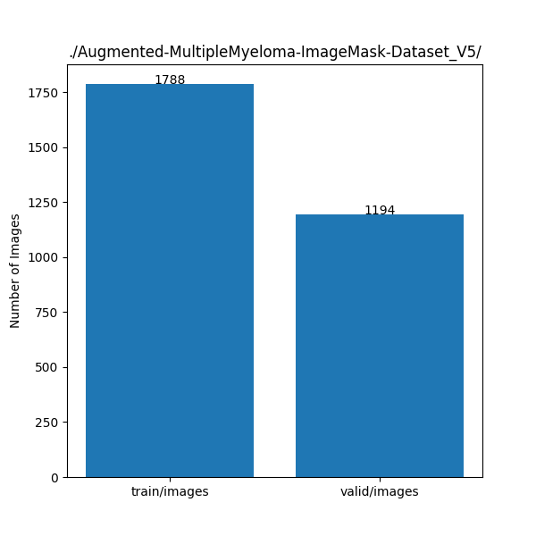 

You can download this dataset from the following google drive 
<a href="https://drive.google.com/file/d/1gqmN7t9kkLMpn0xM8fOhBsv3T3-Ea64X/view?usp=sharing">Augmented-MultipleMyeloma-ImageMask-Dataset_V5.zip</a>
 

